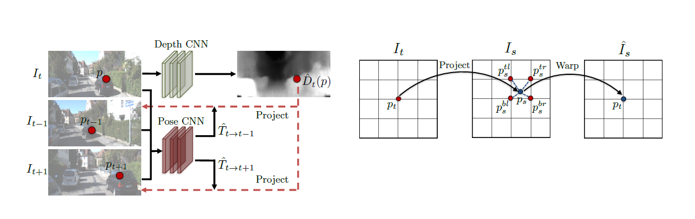

# [Full Surround Monodepth from Multiple Cameras](https://arxiv.org/abs/2104.00152)

Published: 2021-03

Tags: [self-supervised](../tags/selfsupervised.md)

tl;dr: Self-supervised 360° point cloud generation from multi-camera images by exploiting temporal and spatial overlap.
## Summary
Self-supervised learning of a model for 360° Point-Cloud generation from a multi-camera rig. It does not require ground truth depth for training. The model predicts depth maps and relative poses for every image in the rig. Training is done via view synthesis, by projecting to images from both different cameras in the rig (spatial) and previous timestamps of the same camera (temporal).

## Technical Details

1. For a target image $I_T$, context (or reference) images $I_c$ are obtained. Context images are preceding or following $I_t$ either temporally or spatially (from a neighboring camera). 
2. Model predicts depth for target image and relative pose to reference images. 
3. Each target pixel is projected into context images using depth and pose (and bilinear interpolation).
4. Each pixel in the context image are now warped back to the target image (using calibrated camera matrices).
5. Reprojection loss between target image and synthesized image is used as training signal.

## Notes
- Using non-overlapping masks and self-occlusion masks to prevent usual multi-camera problems like the static world assumption or birghtness inconsistencies. 
- The self-occlusion masks have to be set **manually**.
- Use structure similarity loss (SSIM) and photometric error in the loss.

## Questions
- Pose consistency contraints are not mentioned in the loss function? Are they just added to the loss from equation 1?

## Related
[1] [Spatial Transformer Networks](https://arxiv.org/abs/1506.02025)
[2] [Unsupervised Learning of Depth and Ego-Motion from Video](https://arxiv.org/abs/1704.07813)