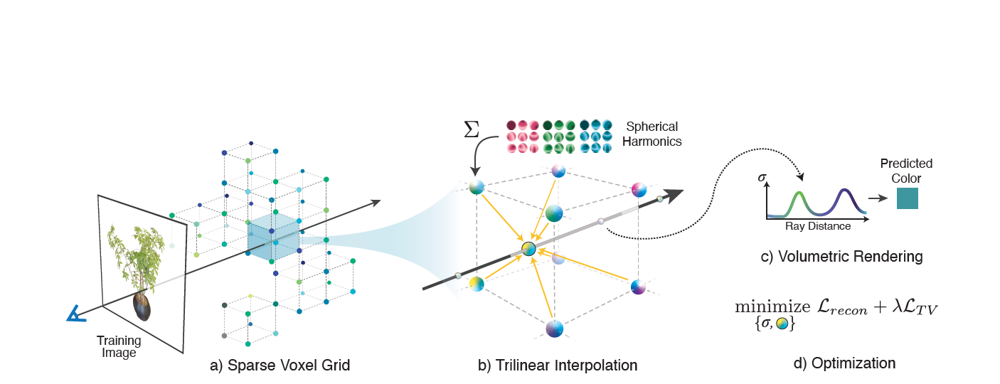

# [Plenoxels: Radiance Fields without Neural Networks](https://arxiv.org/abs/2112.05131)

Published: 2021-12

Tags: [NeRF](../tags/nerf.md)

tl;dr: System for photorealistic view synthesis via gradient methods. Orders of magnitude faster optimization and rendering compared to NeRF.

## Summary
Given a set of images of an object or scene, a sparse voxel grid is constructed (a), where each voxel contains density and spherical harmonics coefficients. For each sample point along a ray, these coefficients are computed via trilinear interpolation of neighboring voxels (b) and differentiable volumetric rendering as in NeRF (c). Afterwards, the voxel coefficients can be optimized via MSE reconstruction loss of all images (d). Standard gradient descent is used to optimize these parameters instead of learning neural networks, leading to significant speed-ups.

## Technical Details

- Sparse voxel grid is realized by storing values for occupied voxels only. A dense 3D array then holds pointers to these sparse arrays.
- 27 harmonic coefficients and one opacity value are stored for each voxel.
- High resolution can be achieved by first start with a more dense grid and pruning unnecessary voxels afterwards. To increase resolution again, existing voxels can be split again (initialized via trilinear interpolation).
- Use MSE reconstruction loss to directly optimize coefficients. 
- Add a total variation regularizer to penalize strong differences in harmonics and density among nearby voxels.

## Notes
- Can be extended to unbounded scenes (like forward facing) --> This might be interesting.
- Using RMSprop to deal with ill-conditioned problem of volumetric rendering (using second-order method is too expensive).
- Code (and video) available at: https://github.com/sxyu/svox2

## Questions

## Related
[1] [NeRF: Representing Scenes as Neural Radiance Fields for View Synthesis](https://arxiv.org/abs/2003.08934) ([notes](202003_NeRF_Representing_Scenes_as_Neural_Radiance_Fields_for_View_Synthesis.md))