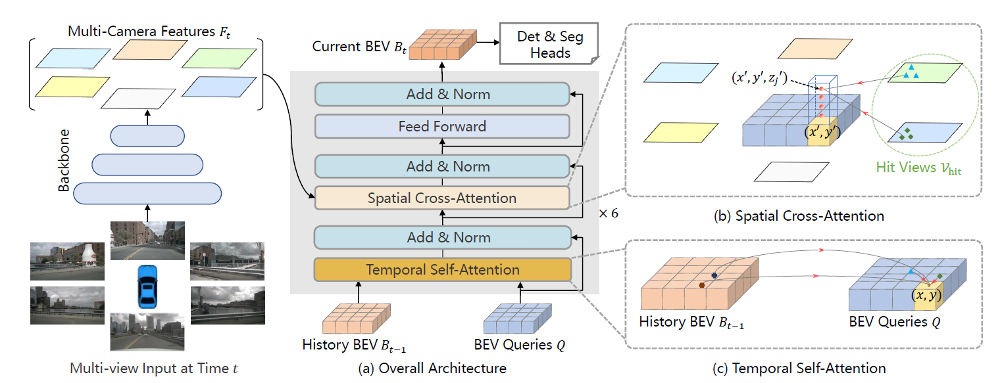

# [BEVFormer: Learning Birds-Eye-View Representation from Multi-Camera Images via Spatiotemporal Transformers](https://arxiv.org/abs/2203.17270)

Published: 2022-03

Tags: [BEV](../tags/bev.md)

tl;dr: New transformer called spatiotemporal transformer exploits both spatial and temporal information for BEV generation in a multi-camera setting. 
## Summary
The authors present a novel, transformer-based architecture that aggregates spatial and temporal features from multi-view cameras and BEV features from previous timesteps into a BEV representation. The BEV representation can be used for multiple autonomous driving perception tasks like 3D detection and map segmentation.

Evaulated on nuScenes and Waymo datasets and consistently outperforms prior methods like DETR3D [1]() and Lift-Splat-Shoot [2]() on object detection and map segmentation tasks. An ablation study shows the effectiveness of the different components of the architecture.

## Technical Details

6 stacked layers, each consists of:
1. "Temporal self-attention" between previous BEV features $B_{t-1}$ and fixed BEV Queries $Q$.
2. "Spatial cross-attention" between camera features $F_t$ and BEV features after temporal attention.
3. Skip-connections and normalization as well as a feed-forward layer.

## Notes
- The paper has a lot of grammar and spelling errors.

## Questions

## Related
[1] [DETR3D: 3D Object Detection from Multi-view Images via 3D-to-2D Queries](https://arxiv.org/abs/2110.06922)  
[2] [Lift, Splat, Shoot: Encoding Images from Arbitrary Camera Rigs by Implicitly Unprojecting to 3D](https://arxiv.org/abs/2008.05711) ([notes]())
[3] [Vision Transformer with Deformable Attention](https://arxiv.org/abs/2201.00520)  