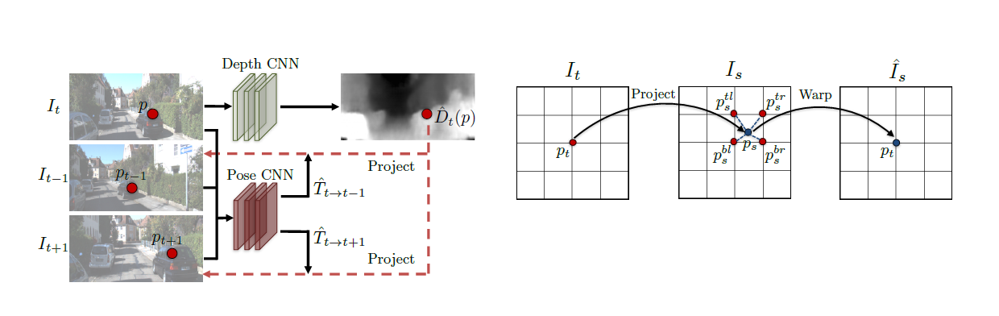

# [Full Surround Monodepth from Multiple Cameras](https://arxiv.org/abs/2104.00152) ([local](../local/fsm.pdf))

Published: 2021-03

Tags: [self-supervised](../tags/selfsupervised.md)

tl;dr:
## Summary
Self-supervised learning of a model for 360° Point-Cloud generation from a multi-camera rig. It does not require ground truth depth for training. The model predicts depth maps and relative poses for every image in the rig. Training is done via view synthesis, by projecting to images from both different cameras in the rig (spatial) and previous timestamps of the same camera (temporal).

## Technical Details

## Notes
- Using non-overlapping masks and self-occlusion masks to prevent usual multi-camera problems like the static world assumption or birghtness inconsistencies. 
## Questions

## Related
[1] [Spatial Transformer Networks](https://arxiv.org/abs/1506.02025)
[2] [Unsupervised Learning of Depth and Ego-Motion from Video](https://arxiv.org/abs/1704.07813)